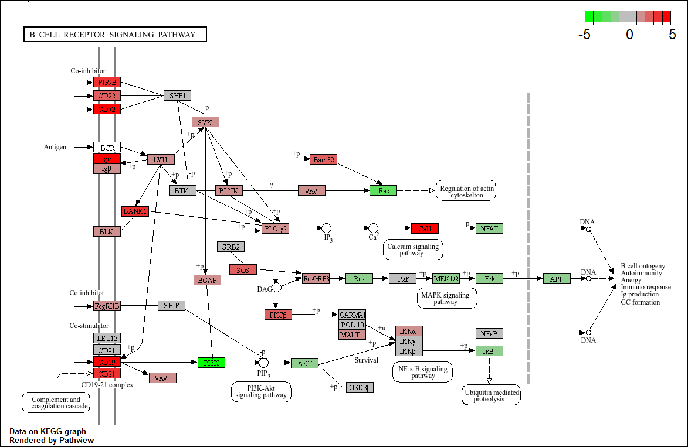

# CasusRA
*Inleiding* 

Reumatoïde Artritis (RA) is een chronische, inflammatoire auto immuunziekte die wereldwijd miljoenen mensen treft. De aandoening kenmerkt zich door pijnlijke zwelling in de gewrichten, wat op termijn kan leiden tot ernstige gewrichtsschade en functieverlies, en heeft een aanzienlijke impact op de levenskwaliteit van patiënten. De precieze oorzaak van RA is complex, maar een ontregeld immuunsysteem speelt een centrale rol. B cellen, T cellen en pro inflammatoire cytokines dragen bij aan de aanhoudende ontsteking. Het verkrijgen van een dieper inzicht in de moleculaire mechanismen die ten grondslag liggen aan RA is essentieel voor de ontwikkeling van effectievere diagnostische methoden en gerichte therapieën. Het doel van dit onderzoek was dan ook het identificeren van differentieel tot expressie gebrachte genen bij RA patiënten in vergelijking met gezonde individuelen, om zo potentiële biomarkers en ziektegerelateerde pathways te ontdekken. 

*Methode* 

In deze onderzoek is er begonnen met naar de RNA sequencing data kijken van 8 personen 4 met RA en 4 zonder. De voledige data analyse is uitgevoerd in R(versie 4.4.2) met de hulp van diverse pakketen. Er was eerst een countmatrix gemaakt voor voor de eerste 8 personen. De ruwe sequencing data was uitgepakt. Met Rsubread (versie 2.20.0) is er een referentie index gemaakt van het humaan genoom (Homo sapiens, GRCh38). De sequencie reads waren vervolgens uitgelijnd tegen deze index en BAM bestanden waren geproduceerd. Deze BAMs werden gesorteerd en geïndexeerd met Rsamtools (versie 2.22.0). Voor genexpressie kwantificatie is de featurecounts functie van Rsubread (versie 2.20.0) met als einduitslag een countmatrix. 

Voor volledige genexpressie analyse is echter een al voorbereide, grotere countmatrix gebruikt [Data/count_matrix.txt](Data/count_matrix.txt) , die door de begeleider is aangeleverd. Deze grotere countmatrix en bijbehorende sample informatie werden vervolgens ingelezen in DESeq2 (versie 1.46.0). Hierin werden log2 fold change waarden en aangepaste p waarden (padj) berekend, waarbij genen met een padj < 0.05 en een |log2FoldChange| > 1.5 als significant differentieel tot expressie werden beschouwd. Functionele analyse en visualisatie zijn gedaan met gespecialiseerde R pakketten zoals goseq (versie 1.58.0) voor Gene Ontology (GO) termanalyse (org.Hs.eg.db (versie 3.20.0) en GO.db (versie 3.20.0)), EnhancedVolcano (versie 1.24.0) voor het genereren van Volcano plots, en pathview (versie 1.46.0) (met ondersteuning van KEGGREST (versie 1.46.0)) voor KEGG pathwayvisualisatie. Data manipulatie en plotting werden verder ondersteund door dplyr (versie 1.1.4), magrittr (versie 2.0.3) en ggplot2 (versie 3.5.2). 

*Resultaten* 

De resultaten tonen significante verschillen in genexpressiepatronen tussen RA patiënten en gezonde controlepersonen. De Volcano plot [bekijk de Volcano Plot hier](results/Screenshot%202025-06-08%20154951.png)  visualiseert deze differentiële genexpressie over alle 29.407 genen. Een aantal genen toonde significant verhoogde of verlaagde expressie, gedefinieerd door een absolute log2 fold change van meer dan 1.5 en een padj van minder dan 0.05. Dit wijst op moleculaire veranderingen kenmerkend voor RA. De GO analyse  identificeerde meer aanwezige biologische processen. Zoals verwacht bij een auto immuunziekte, dit waren voornamelijk  de immunoglobulin complex, adaptive immune response en B cel mediated immunity. De hoge statistische significantie bevestigt een fundamenteel ander immuunsysteem bij RA. De KEGG pathway analyse  liet zien dat de B cel Receptor Signaalroute (hsa04662) genen bevatte die significant verschillend tot expressie kwamen. Binnen de keten Antigen , BTK , BLNK , VAV, Bam32 en Rac waren BTK, BLNK en VAV upregulated (rood). Echter, Rac was significant downregulated (groen), met een log2 fold change van ongeveer 3.  

Conclusie
